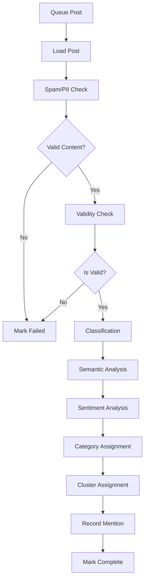

# AI Orchestrator Service

A complete AI-powered post processing orchestrator built with Node.js, TypeScript, and LangGraph. This service processes posts through a multi-stage pipeline including validity checks, classification, sentiment analysis, semantic analysis, clustering, and trend detection.

## <� Architecture

The orchestrator accepts raw post JSON and processes it through a graph-based pipeline:

1. **Accept Post JSON** - Receives post data from your MongoDB service
2. **Spam/PII Check** - Detects spam and personal information
3. **Validity Check** - Determines if post contains actionable problems
4. **Classification** - Categorizes posts (bug, feature request, question, etc.)
5. **Semantic Analysis** - Generates summary, keywords, and embeddings
6. **Sentiment Analysis** - Analyzes emotional tone
7. **Category Assignment** - Assigns to industry/domain categories
8. **Cluster Assignment** - Groups similar posts using vector similarity
9. **Record Mention** - Tracks mentions for trend analysis
10. **Finalize** - Marks processing complete and stores results in Postgres

## =� Quick Start

### Prerequisites

- Node.js 18+ 
- PostgreSQL with pgvector extension
- Redis server
- Supabase account (or direct Postgres connection)
- OpenAI API key

### Installation

1. **Clone and install dependencies**:
```bash
cd apps/ai-orchestrator
npm install
```

2. **Set up environment variables**:
```bash
cp .env.example .env
# Edit .env with your actual values
```

3. **Initialize database**:
```bash
# If using Supabase, run this in the SQL editor
# If using direct Postgres, run:
psql -d your_database -f scripts/init_db.sql
```

4. **Generate database types** (if using Supabase):
```bash
npm run generate-types
```

### Running the Service

**Development mode**:
```bash
npm run dev
```

**Production**:
```bash
npm run build
npm start
```

### Processing Posts

The orchestrator accepts raw post JSON (from your MongoDB service) and processes it through the AI pipeline. You have two options:

**Option 1: API Endpoints (Recommended)**

Start the API server:
```bash
npm start server
```

Send post JSON for processing:
```bash
# Queue for asynchronous processing
curl -X POST http://localhost:3000/api/process-post \
  -H "Content-Type: application/json" \
  -d '{
    "post": {
      "id": "1ngg5or",
      "title": "Are you solving a problem?",
      "body": "I want to work with like-minded people...",
      "author": {"name": "MostStorage8989"},
      "score": 7,
      "url": "https://reddit.com/...",
      "subreddit": {"display_name": "startups"}
    }
  }'

# Or process synchronously (waits for completion)
curl -X POST http://localhost:3000/api/process-post-sync \
  -H "Content-Type: application/json" \
  -d '{"post": {...}}'
```

**Option 2: Direct Queue Integration**

```typescript
import { addPostToQueue } from './src/queues/orchestrator.queue';
import { RawPost } from './src/types';

const postData: RawPost = {
  id: "1ngg5or",
  title: "Are you solving a problem?",
  body: "I want to work with like-minded people...",
  author: { name: "MostStorage8989" },
  score: 7,
  url: "https://reddit.com/...",
  subreddit: { display_name: "startups" }
};

// Add to queue
await addPostToQueue(postData);
```

**Option 3: Worker Mode**

Start the worker to process queued posts:
```bash
npm start worker
```

## =� Monitoring & Scripts

### Calculate Trends
```bash
npm run trends:calculate
```

### Recompute Clusters
```bash
npm run clusters:recompute
```

### API Endpoints

When running in server mode, the orchestrator exposes these endpoints:

- `GET /health` - Health check
- `POST /api/process-post` - Queue post for async processing
- `POST /api/process-post-sync` - Process post synchronously
- `GET /api/queue/status` - Get queue status and metrics

### Check Queue Status
```bash
curl http://localhost:3000/api/queue/status
```

## =' Configuration

### Environment Variables

| Variable | Description | Default |
|----------|-------------|---------|
| `NODE_ENV` | Environment mode | development |
| `PORT` | Server port | 3000 |
| `SUPABASE_URL` | Supabase project URL | - |
| `SUPABASE_KEY` | Supabase anon key | - |
| `REDIS_HOST` | Redis hostname | localhost |
| `REDIS_PORT` | Redis port | 6379 |
| `OPENAI_API_KEY` | OpenAI API key | - |
| `OPENAI_MODEL` | GPT model to use | gpt-4-turbo-preview |
| `EMBEDDING_MODEL` | Embedding model | text-embedding-ada-002 |
| `ORCH_CONCURRENCY` | Worker concurrency | 5 |
| `CLUSTER_SIMILARITY_THRESHOLD` | Clustering threshold | 0.7 |
| `MAX_TOKENS_PER_MINUTE` | Rate limit for tokens | 100000 |
| `MAX_REQUESTS_PER_MINUTE` | Rate limit for requests | 100 |

### Rate Limiting & Cost Controls

The service includes built-in rate limiting and cost controls:

- Token bucket algorithm for OpenAI API calls
- Configurable retry logic with exponential backoff  
- Request batching for embeddings
- Comprehensive metrics collection

## >� Components

### Agents

Each processing stage is handled by specialized agents:

- **ValidityAgent**: Checks if posts contain actionable problems
- **ClassificationAgent**: Categorizes posts into predefined types
- **SemanticAgent**: Generates summaries, keywords, and embeddings
- **SentimentAgent**: Analyzes emotional tone and sentiment
- **CategoryAgent**: Assigns posts to industry/domain categories
- **ClusterAgent**: Groups similar posts using vector similarity
- **SpamAgent**: Detects spam and PII content

### Repositories

Data access layer with methods for:

- **PostsRepository**: CRUD operations and processing status management
- **CategoriesRepository**: Category management with auto-creation
- **ClustersRepository**: Cluster management and centroid updates
- **MentionsRepository**: Mention tracking for trend calculation

### Services

- **OrchestratorService**: Main orchestration logic using LangGraph
- **ClusteringService**: Vector similarity and clustering algorithms
- **TrendsService**: Trend detection and scoring

## =� Database Schema

The service uses PostgreSQL with pgvector extension. Key tables:

- **posts**: Main post data with processing results
- **categories**: Hierarchical categories
- **clusters**: Vector clusters with centroids
- **mentions**: Mention tracking for trends
- **trends**: Calculated trend scores
- **audit_log**: Processing audit trail

## = Processing Flow



## =� Error Handling

- **Idempotency**: Posts won't be processed twice
- **Retry Logic**: Failed posts retry with exponential backoff
- **Graceful Degradation**: Individual stage failures don't block the entire pipeline
- **Comprehensive Logging**: Full audit trail of all processing steps

## =� Metrics & Observability

The service collects comprehensive metrics:

- Posts processed per minute
- Processing latency by stage
- Token usage and costs
- Error rates by agent
- Queue depth and processing times

## = Security Features

- **PII Detection**: Automatic detection and flagging of personal information
- **Spam Filtering**: Multi-layer spam detection
- **Rate Limiting**: Protection against API abuse
- **Input Validation**: Comprehensive input sanitization

## >� Testing

Run the test suite:
```bash
npm test
```

The tests cover:
- Repository operations
- Agent functionality (with mocked LLM calls)
- Orchestration flow
- Error handling scenarios

## = Troubleshooting

### Common Issues

1. **Database Connection Errors**:
   - Verify Supabase credentials
   - Ensure database is accessible
   - Check if pgvector extension is installed

2. **OpenAI API Errors**:
   - Verify API key is correct and has credits
   - Check rate limits in OpenAI dashboard
   - Ensure model names are correct

3. **Redis Connection Issues**:
   - Verify Redis server is running
   - Check connection credentials
   - Ensure Redis is accessible from your network

4. **Processing Stuck**:
   - Check queue status: `orchestratorQueue.getQueueStatus()`
   - Look for failed jobs: `orchestratorQueue.getFailed()`
   - Review logs for error patterns

### Logs Location

Logs are output to console in development. Configure log persistence as needed for production.

## > Contributing

1. Follow TypeScript strict mode guidelines
2. Add tests for new functionality
3. Update documentation for API changes
4. Use conventional commit messages

## =� License

[Your License Here]